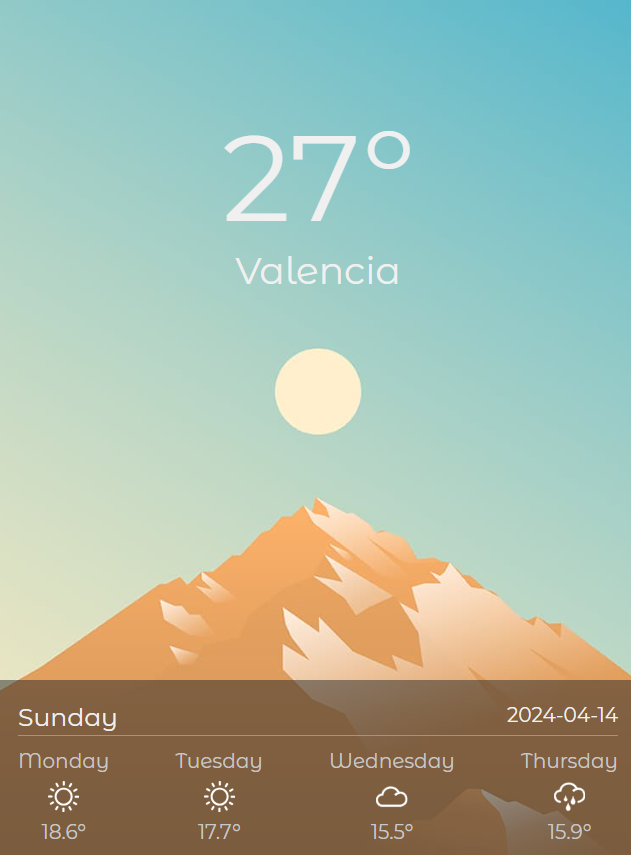

# Weather App

This is a simple weather application that provides the current weather and a 5-day forecast for the city of Valencia. It utilizes the WeatherAPI to fetch weather data. Keep in mind that I have only programmed it for mobile devices because I have planned it in a way that the user can quickly see what the weather is going to do. I also added to it to change the background according to the current time.

## Features

- Provides current weather conditions in Valencia.
- Offers a 5-day forecast for Valencia.
- Easy-to-use interface.

## Usage

To use this application, simply clone the repository and open the `index.html` file in a web browser. The weather information for Valencia will be displayed automatically.

## Future Improvements

Currently, the application only supports fetching weather data for Valencia. In the future, I plan to enhance the project by allowing users to select their preferred geographical location and receive weather information for that city.

## Technologies Used

- [Astro](https://astro.build/)
- [TailwindCSS](https://tailwindcss.com/)
- HTML
- CSS
- JavaScript
- WeatherAPI

## How to Contribute

If you would like to contribute to this project, feel free to fork the repository and submit a pull request with your changes.

## View
